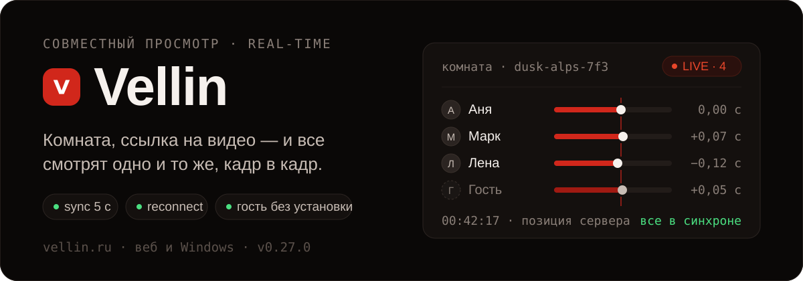
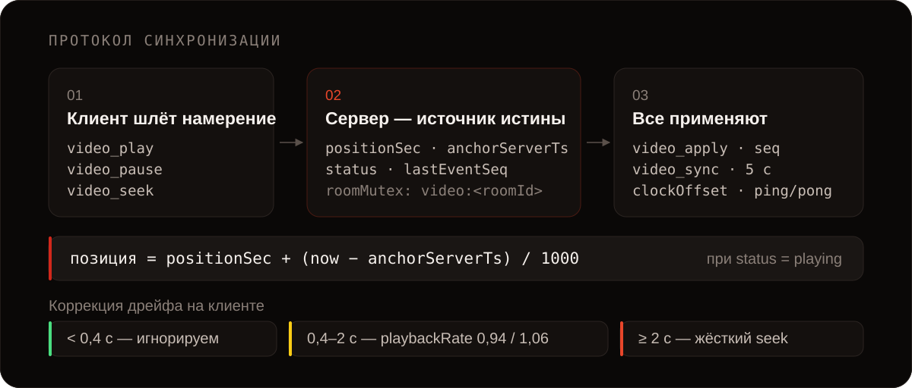
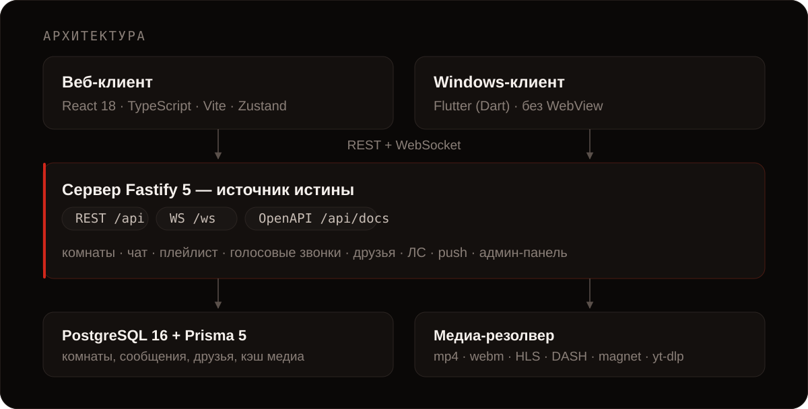

<p align="center">
  
</p>

Создаёте комнату, вставляете ссылку на видео — и все, кто вошёл, видят один и тот же кадр в одну и ту же секунду. Не «примерно вместе», а с точностью до долей секунды: позицию держит сервер, клиенты только подстраиваются под неё.

Работает в браузере и нативным приложением на Windows. Гостю хватит invite-ссылки — ни регистрации, ни установки.

**[vellin.ru](https://vellin.ru)** · веб + клиент для Windows · v0.27.0

## Что внутри

| | |
|---|---|
| **Синхронный плеер** | `play`, `pause`, `seek` и смена видео применяются у всех участников; расхождение правится автоматически |
| **Любая ссылка** | прямые `mp4`/`webm`, HLS `m3u8`, DASH `mpd`, magnet и `.torrent`, плюс всё, что понимает `yt-dlp`: YouTube, RuTube, Vimeo, VK Video и ещё около тысячи сайтов |
| **Плейлист** | очередь видео в комнате — добавить, переставить, включить следующее |
| **Чат и реакции** | живой чат и эмодзи поверх плеера |
| **Голосовые звонки** | WebRTC P2P-mesh прямо в комнате, поверх просмотра |
| **Гостевой вход** | по invite-ссылке, без аккаунта; гости не попадают в базу |
| **Права участников** | хост раздаёт управление плеером и плейлистом, может исключить из комнаты |
| **Друзья и личные сообщения** | текст, картинки, голосовые, видеокружки, статусы «онлайн» и «был в сети» |
| **Push-уведомления** | Web Push с шаблонами, очередью отправки и настройками на пользователя |
| **Админ-панель** | роли и права, аудит действий, модерация, аналитика, feature-флаги |

Видео играет в нативном `<video>` — никаких встроенных iframe-плееров, поэтому плеер один и тот же для всех источников.

## Как держится синхрон

<p align="center">
  
</p>

Клиент никогда не решает сам. Нажатие на паузу — это *намерение*, которое уходит на сервер; на экране оно появляется только когда вернулось решение сервера.

1. Сервер хранит состояние комнаты: `positionSec`, `anchorServerTs`, `status`, `lastEventSeq`.
2. Любая мутация проходит через мьютекс комнаты — параллельные события выстраиваются в одну очередь, счётчик `seq` и якорь остаются согласованными.
3. Каждое изменение рассылается как `video_apply` с номером `seq`; раз в 5 секунд уходит `video_sync` — heartbeat для коррекции дрейфа.
4. Клиент считает поправку на сеть через медиану ping/pong-замеров и решает, догонять ли позицию мягко (скоростью воспроизведения) или жёстким `seek`.
5. При обрыве связи — переподключение с экспоненциальной паузой от 250 мс до 5 с; `welcome` возвращает актуальное состояние.

Состояние комнаты пишется в базу раз в 15 секунд, так что после перезапуска сервера просмотр продолжается с той же позиции.

## Быстрый старт

Нужны Node.js 20+, Docker (для Postgres) и `yt-dlp` в `PATH`.

```bash
npm run setup
```

Одна команда поднимает Postgres в Docker, ставит зависимости, генерирует `server/.env` со случайным `JWT_SECRET`, собирает `@vellin/shared`, накатывает миграции и запускает dev-режим. Скрипт идемпотентный — повторный запуск ничего не перезатирает. Дальше открывайте **http://localhost:5173**.

Без `yt-dlp` всё тоже запустится, но останутся только прямые ссылки и magnet — YouTube и остальные сайты резолвит именно он:

```bash
winget install yt-dlp.yt-dlp   # Windows
brew install yt-dlp            # macOS
pip install yt-dlp             # Linux
```

<details>
<summary><b>Вариант через Docker целиком</b></summary>

```bash
cp .env.example .env
docker compose up --build
```

Фронтенд — http://localhost:8080, бэкенд — http://localhost:3001, Postgres — `localhost:5432` (`vellin`/`vellin`).

</details>

<details>
<summary><b>Вариант по шагам, без setup-скрипта</b></summary>

```bash
docker compose up -d postgres        # 1. база
npm install                          # 2. зависимости всех воркспейсов
cp server/.env.example server/.env   # 3. env; JWT_SECRET — минимум 32 символа
npm run build:shared                 # 4. обязательно до первого старта
npm run db:migrate                   # 5. миграции + Prisma client
npm run dev                          # 6. shared + server + client параллельно
```

</details>

<details>
<summary><b>Проверить, что синхрон действительно работает</b></summary>

1. `docker compose up --build`, дождаться `Vellin server started`.
2. Открыть http://localhost:8080 в двух браузерах (второй — в приватном окне).
3. В первом зарегистрироваться, во втором войти гостем.
4. Из первого создать комнату с любым видео, например `https://test-videos.co.uk/vids/bigbuckbunny/mp4/h264/720/Big_Buck_Bunny_720_10s_1MB.mp4`.
5. Скопировать invite-ссылку, открыть во втором браузере, войти.
6. Play в первом — оба клиента стартуют синхронно. Pause во втором — оба встают.
7. Отправить сообщение и реакцию — приходят мгновенно.
8. DevTools → Network → Offline на 5 секунд и обратно — клиент переподключается сам и догоняет позицию.

</details>

## Архитектура

<p align="center">
  
</p>

```
Vellin/
├── shared/      # @vellin/shared — типы WS-протокола, REST и домена
├── server/      # Fastify: API, WebSocket, Prisma, медиа-резолвер, push, админка
├── client/      # React + Vite: веб-приложение
├── winapp/      # Flutter: нативный клиент для Windows
├── installer/   # установщик и апдейтер Windows-клиента
├── design/      # исходный визуальный макет — источник дизайн-токенов
├── docs/        # контракты и планы (админ-панель v2)
├── caddy/       # обратный прокси для продакшена
└── scripts/     # setup.mjs и утилиты
```

Монорепо на npm workspaces. `shared/` — единственный источник правды для протокола: и сервер, и оба клиента импортируют одни и те же типы, поэтому рассинхрон контрактов невозможен по построению. Любое изменение WS-сообщений или REST-схем начинается там.

## API

Полная клиентская поверхность API описана OpenAPI-спекой и живёт в самом приложении:

- Swagger UI — `/api/docs`
- спека — `/api/openapi.json`

Группы маршрутов: `/auth`, `/rooms`, `/friends`, `/dm`, `/titles`, `/push`, `/geo`, `/config`, `/admin/*`.

Два WebSocket-канала:

| Канал | Назначение |
|---|---|
| `/ws?ticket=<wsTicket>` | комната: видео, чат, плейлист, реакции, права, голосовые звонки |
| `/ws/user` | пользователь: presence, уведомления, личные сообщения |

Комнатный сокет требует короткоживущий тикет (60 секунд), который выдаёт `POST /rooms/join`. Так долгоживущий JWT не попадает в URL — единственный способ аутентифицировать WebSocket-рукопожатие. Все типы сообщений — в [`shared/src/protocol.ts`](shared/src/protocol.ts).

## Клиент для Windows

`winapp/` — нативное приложение на Flutter, без WebView и HTML-рантайма. Собирается через `flutter build windows`, ставится собственным установщиком из `installer/`, обновляется через версионный гейтинг: клиент шлёт `X-App-Platform` и `X-App-Version`, сервер отвечает `426`, если версия ниже минимальной. Подробности — в [winapp/README.md](winapp/README.md).

## Безопасность

- bcrypt (cost 12) для паролей пользователей и комнат
- JWT в `Authorization: Bearer`, сессия 30 дней; отдельный 60-секундный тикет для WebSocket
- rate-limit: 100 req/min глобально, 5–10/min на `/auth/*`, token bucket 20 msg/s на сокет
- CORS-allowlist, helmet-заголовки, лимит тела запроса 256 КБ
- мьютекс на комнату против гонок в видео-состоянии
- гости не сохраняются в базу, сообщения чата — plain text с лимитом 2000 символов

## Скрипты

```bash
npm run dev          # shared + server + client параллельно
npm run dev:server   # только сервер
npm run dev:client   # только клиент
npm run build        # сборка shared → server → client
npm run db:migrate   # prisma migrate dev
npm run db:studio    # prisma studio
```

## Деплой

[DEPLOY.md](DEPLOY.md) — пошаговая инструкция для Ubuntu-VPS: домен, SSH-хардеринг, Docker, Caddy с Let's Encrypt, env, миграции, бэкапы.

## Статус

Публичная бета. Автотестов в репозитории нет — проверка ручная, рецепт выше. Лицензия не опубликована: код закрыт для повторного использования.
